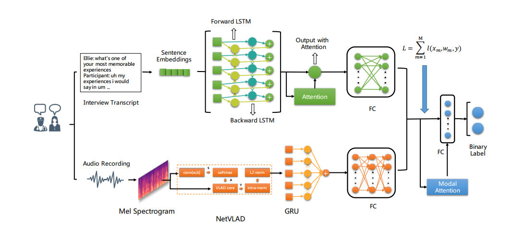

# Usage 

环境的话上次让你安装好tensorflow了，现在你需要安装一个torch 2.1.2 (cpu版本的也行)

其他小包缺什么pip install 什么

特殊的包安装:

```
elmoformanylangs

依次以下执行命令, 
git clone https://github.com/berkay-onder/ELMoForManyLangs
打开 ELMoForManyLangs/elmoformanylangs/modules/highway.py文件

将ELMoForManyLangs/elmoformanylangs/modules/highway.py文件中的第47-48
47     def forward(self, inputs: torch.Tensor) -> torch.Tensor:  # pylint: disable=arguments-differ
48         current_input = inputs
替换成
47    def forward(self, *input: torch.Tensor) -> None:  # pylint: disable=arguments-differ
48        current_input = input[0]

再 pip install -e ELMoForManyLangs/

详细参考: https://github.com/HIT-SCIR/ELMoForManyLangs/issues/95

window cd不了的话，直接进入ELMoForManyLangs文件夹内，在ELMoForManyLangs目录下运行
```



整个仓库的运行流程为 : 分别提取音频和文本的特征，之后分别将他们的特征用 GRU 和 LSTM 进行训练，得到对应的单个模型。然后在融合阶段，将这两个模型冻结，分别让特征再过一遍单个模型，得到适应于抑郁症预测任务的文本和音频表征后，再进行特征的融合进而融合不同模态表征以实现抑郁症预测的更好表现。

这样运行各个文件的顺序就明了了：

```
先将 zhs.model 放到Classigication目录下
cd Classigication

# 特征
python audio_features_whole.py
pyhton text_features_whole.py


cd Regression
# 单个模型
python audio_bilstm_perm.py
python text_bilstm_perm.py
这两个模型分别都用了三折交叉验证，他数据好像是编号为17的样本数据缺失了。选3折会报错，因为第三次划分就会报错。我就改成2，你写论文可以直接写三折交叉验证了。没问题的

运行完上述两个python文件你就能得到两个模态的单个模型， 之后就是融合的过程
打开fuse_net_v1.py

第31-32行可以换成你自己训的模型，不过我都打包给你。直接 python fuse_net_v1.py运行就行了
text_model_paths = ['Model/Regression/Text1/BiLSTM_128_10.91.pt', 'Model/Regression/Text2/BiLSTM_128_9.66.pt']
audio_model_paths = ['Model/Regression/Audio1/gru_vlad256_256_10.26.pt', 'Model/Regression/Audio2/gru_vlad256_256_11.23.pt']

跑出来的模型, 8.23表示mae， 10.93表示rmse的值。
fuse_8.23_10.93.pt
因为随机比较大，每次运行结果差距比较大，你多运行几次也许能出更高的指标
```